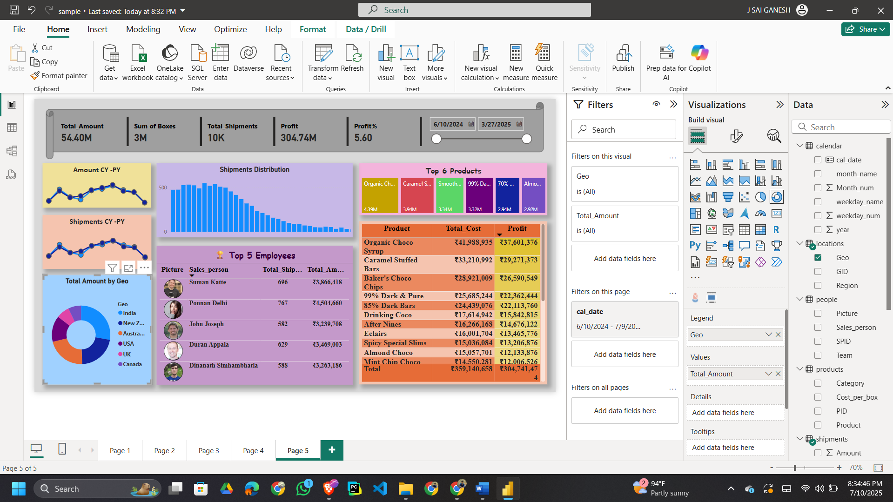
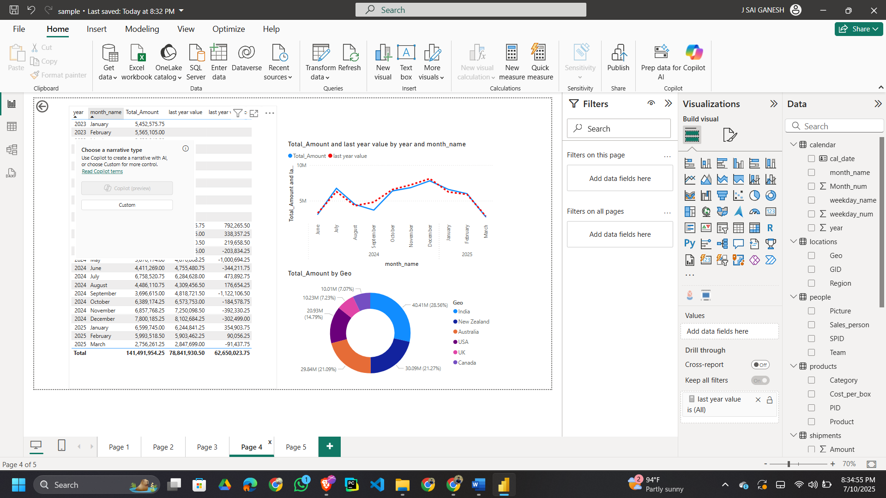
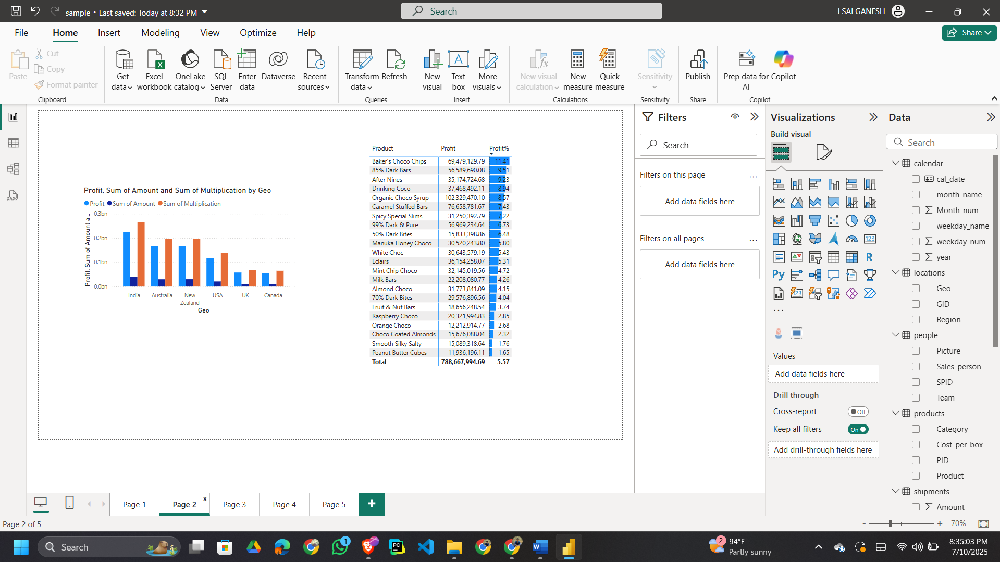
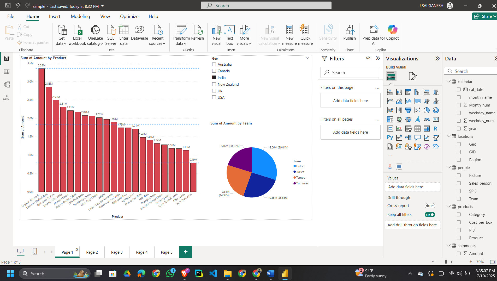

# 📊 Sales Report Power BI Template

This repository contains a complete Power BI `.pbit` report template designed to analyze chocolate sales performance across products, people, locations, and time. It uses sample data to provide insights such as profit, sales trends, KPIs, and visual storytelling using multiple chart types.

---

## 📁 Folder Structure
```
Sales_Report_Template/
│ Sales_Report.pbit
│
├── Images/
│ ├── Output_images/
│ │ ├── final_report.png
│ │ ├── preparation_1.png
│ │ ├── preparation_2.png
│ │ ├── preparation_3.png
│ │ └── preparation_4.png
│ │
│ └── Sample_Report_Template_background_image/
│ ├── background_template.png
│ ├── boxes_icon.png
│ ├── currency_icon.png
│ ├── graph_icon.png
│ ├── shipping_icon.png
│ └── tick_mark_icon.png
│
└── Sample_Data_File/
└── sample-chocolate-shipments-data-all-Apr-2025.xlsx
```
---

## 🗃️ Sample Data Tables Used

### 1. **Shipments Table**
Contains individual shipment records with these fields:
- ShipmentID, SPID, PID, GID, Shipdate, Amount, Boxes, Order_Status

### 2. **Products Table**
List of all chocolate products with:
- Product Name, Category, Cost per Box, PID

### 3. **Locations Table**
Defines regional sales zones:
- Geo, Region, GID

### 4. **People Table**
Contains sales representatives and their team/pictures:
- Sales_person, Team, Picture, SPID

### 5. **Calendar Table**
Used for time intelligence (Jan 2023 – Mar 2025):
- cal_date, Month_num, month_name, year, weekday_num, weekday_name

---

## 🎨 Key Features of the Report

### ✅ Summary KPIs via Cards:
- Total Sales Amount
- Total Shipments
- Total Profit
- Profit %
- Delivered Shipment Count
---
### 🥇 Top Insights:
- **Top 5 Employees** based on sales performance
- **Top 6 Products** based on profit and revenue
- **All Product Profit Analysis** (profit, profit %, total amount)
---
### 📊 Visual Elements:
- **Line Chart**: 13-month shipment & amount comparison (YoY)
- **Donut Chart**: Shipments by location/region
- **Stacked Column Chart**: Shipments by status
- **Treemap**: Top 6 high-selling chocolates
- **Slicers**: Calendar slicers for dynamic filtering
---
### 📷 Preview:







---

## 💡 How to Use

1. 📁 **Download the sample data file**  
   `sample-chocolate-shipments-data-all-Apr-2025.xlsx` from the repository and save it to a location on your computer.

2. 📥 **Download the `.pbit` Power BI template file** from this repository.

3. 🧭 **Open** the file in **Power BI Desktop**.

4. 🔗 When prompted (or if an error appears), **update the data source path** by locating the file you downloaded in Step 1.

5. 📂 **Load or replace** the sample data with your own data  
   > (Ensure the structure of your data matches the original sample).

6. 📊 **Explore** the visualizations, use slicers/filters, and gain insights instantly!

---

## ✅ How to Change the File Path in Power BI

### 🔄 For Excel, CSV, or Flat File Data Sources:

### 🧭 Step-by-Step:

1. **Open** your Power BI report (`.pbix` or `.pbit`).

2. Go to the **Home** tab → Click **Transform data** → Then click **Transform data** again (this opens Power Query Editor).

3. In the **Queries pane** on the left, select your data source (e.g., `Shipments`, `Products`).

4. Locate the **Formula Bar**, where you'll see a line like this:

   ```powerquery
   Source = Excel.Workbook(File.Contents("F:\powerbi\sample.xlsx"), null, true)
   ```
5. Edit the file path to reflect the new location on your system. For example:
```
Source = Excel.Workbook(File.Contents("C:\Users\YourName\Documents\PowerBI_Data\sample.xlsx"), null, true)
```
6. Press Enter to apply the changes.

7. Repeat for each data source if there are multiple.

8. Click Close & Apply to reload the data with the new path.


---


## 📫 Contact
### 👤 Author:-  **Sai Ganesh**  
📧 Email: [jadasaireddy@gmail.com](mailto:jadasaireddy@gmail.com)  
💻 GitHub: [@jadasaiganesh](https://github.com/jadasaiganesh)  
🗓️ Year: 2025

---
